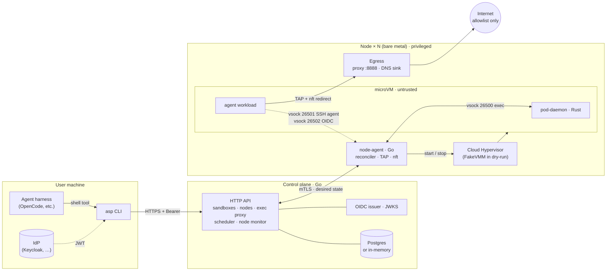

# Agent Sandbox Platform (ASP)

[](https://github.com/luisgf/agent-sandbox-platform/actions/workflows/ci.yml)
[](LICENSE)

**Run the code your AI agent writes inside a microVM — never on your host.**

ASP is a self-hosted, FOSS sandbox platform for coding agents. An agent harness gets a long-lived **session**: one Cloud Hypervisor microVM with its own disk, its own deny-by-default egress and an owner taken from your IdP. Every shell command the agent runs goes through `asp session exec` and executes inside that guest. Your SSH keys, your tokens and the hypervisor socket stay on the host.

> Independent project. Not affiliated with, sponsored or endorsed by Cursor, Anysphere, anyrun or related products. The design is inspired by that kind of sandbox; the code and threat model are our own.

## Why

| Problem | What ASP does |
|---|---|
| Agent-generated code runs with your user's privileges on your machine. | Every command runs in a **microVM** (KVM + Cloud Hypervisor). The VM is the primary security boundary. |
| Booting a VM per tool call is too slow, so harnesses fall back to the host. | A **session** keeps one sandbox alive for hours; dozens of `exec` calls share the same guest. |
| Agents need Git/SSH and cloud tokens, but secrets must not leak into the guest. | The **SSH agent stays on the host** (bridged over vsock) and the guest only gets **short-lived OIDC tokens** minted by the control plane. |
| You need to know *who* owns a sandbox. | `owner_sub` comes from the **IdP token**, never from the client body or the guest. |
| An agent should not reach arbitrary hosts. | **Deny-by-default egress**: forward proxy + DNS sink + nftables, with a per-tenant allowlist. |

ASP is **not** a Kubernetes replacement (sandboxes are not Pods, [why](docs/concepts/asp-vs-kubernetes.md)), does **not** do TPM/SEV attestation and is **not** a multi-language SDK: the `asp` CLI and the [HTTP API](docs/reference/api.md) are the contract.

## Quickstart

On a Linux host with KVM, everything on one machine and nothing to configure ([details](docs/how-to/single-host.md)):

```bash
curl -fsSL https://github.com/luisgf/agent-sandbox-platform/releases/latest/download/install.sh | sudo INSTALL_ASP_ROLE=standalone sh
sudo asp session start
sudo asp session exec --cmd 'uname -a'
```

There is no published release yet (the first will be 0.1.0). Until then, build from source (`make build`) and follow [Getting started](docs/getting-started/quickstart.md), which also has the **dry-run** path for a laptop or CI without KVM (it exercises the whole control path and **isolates nothing**) and the multi-server setup. To put an agent in a session: [Using ASP with OpenCode](docs/getting-started/opencode.md).

## How it fits together

Four processes, three trust boundaries. Only the node agent ever talks to the hypervisor; the client never sees it. Capacity grows by adding servers: one node agent per server, and the control plane places each sandbox on a node with room ([ADR-0011](docs/adr/0011-multi-node.md)). The session, the states of a sandbox and the network are in [Concepts](docs/concepts/sessions-and-lifecycle.md); what is protected from whom, in the [security model](docs/concepts/security-model.md).



| Component | Path | Language | Responsibility |
|---|---|---|---|
| **Control plane** | [`control-plane/`](control-plane/) | Go | API, scheduler, node monitor, event journal, node PKI (mTLS), egress policies, OIDC issuer, attestation. |
| **Node agent** | [`node-agent/`](node-agent/) | Go | Per server: runs one Cloud Hypervisor per sandbox, its TAP, nftables and egress proxy, the vsock bridges, `virtiofsd`, WireGuard. |
| **pod-daemon** | [`pod-daemon/`](pod-daemon/) | Rust | Inside the guest: runs the commands it receives over vsock. |
| **Guest image** | [`images/guest/`](images/guest/) | shell | A minimal Debian rootfs with the units for the pod-daemon and the vsock proxies. |
| **CLI `asp`** | [`cli/`](cli/) | Go | `session`, `sandbox`, `auth`, `node`, `apikey`, `image`; `asp-server` runs a control plane and a node in one process. |

## Documentation

The documents under `docs/` are written in Spanish. **Start at the [documentation index](docs/README.md)**: getting started, concepts, how-to guides, reference ([API](docs/reference/api.md), [CLI](docs/reference/cli.md), [configuration](docs/reference/configuration.md), [glossary](docs/reference/glossary.md)), the [architecture decision records](docs/adr/README.md) and the [roadmap](docs/roadmap.md). Changes per version: [CHANGELOG.md](CHANGELOG.md).

## Status and known limits

ASP is an MVP (version 0.x) that has been hardened in phases. **What the code does not do yet is on one page: [known limits](docs/reference/limitations.md).** The ones to know before you start:

- **Isolation needs KVM, and CI has none.** The tests and smokes run the node agent in `--dry-run` (`FakeVMM`), which exercises the control plane and isolates nothing. Real VMs, `enforce` for nftables, `virtiofs` and `--local-net` are checked by hand on a KVM host, and not on a lab of several servers yet.
- **Egress is filtered only in `enforce` mode, for HTTP(S) and DNS over IPv4.** Not IPv6, QUIC or arbitrary UDP; a node that cannot enforce says so (`asp node list`).
- **No migration between nodes.** A sandbox's disk lives on the server that created it: a lost server takes its sessions with it, and a stopped sandbox can only resume on its node. Restarting the node-agent does not stop the VMs; restarting the server does.
- **Attestation is a software signature, not TPM/SEV, and fencing is a webhook** (Redfish and IPMI are stubs). A compromised node can lie about what it booted.
- **The API can change between minor versions** while the major version is 0; the changelog says when.

## Development

```bash
make test    # Go (control plane and node agent with -race), Rust and the guest helper
make lint    # gofmt, go vet and staticcheck in every module, as CI runs them
make docs    # rewrite the generated reference pages (a test fails when one is out of date)
make smoke   # the dry-run end-to-end scripts
```

Each Go component is its own module; `pod-daemon/` is a Cargo crate. How a change gets in: [CONTRIBUTING.md](CONTRIBUTING.md).

## License

[Apache License 2.0](LICENSE). To report a vulnerability, see [SECURITY.md](SECURITY.md).
