# Arquitectura — Agent Sandbox Platform

## Resumen

La plataforma separa **orquestación**, **ejecución privilegiada en el nodo** y **carga invitada**. El camino de control es:

```text
cliente (IDE / asp / automatización)
  → control-plane (API multi-tenant, estado, OIDC, attest, fence)
    → node-agent (reconciler, VMM, TAP, nft, proxies, host-vsock)
      → microVM (Cloud Hypervisor | FakeVMM)
        → pod-daemon (exec/files por vsock)
```

La frontera de seguridad **primaria** es la microVM. Los contenedores dentro del guest, si se incorporan, son comodidad de empaquetado y **no** sustituyen esa frontera.

> Proyecto independiente FOSS, inspirado en sandboxes de agentes de IDE. No afiliado a Cursor, Anysphere ni anyrun.

## Diagrama



Fuente Mermaid editable: [`diagram.mmd`](diagram.mmd). Regenerar SVG: `./scripts/gen-diagram.sh`.

## Threat model (sketch)

| Activo | Amenaza | Mitigación en ASP |
|---|---|---|
| Secretos del operador (SSH keys, OIDC) | Exfiltración desde guest | Claves host-held; OIDC corto; guest no elige claims |
| Aislamiento entre sandboxes / tenants | Escape / lateral movement | microVM + TAP por sandbox; deny-default egress |
| Integridad del nodo | Node-agent o cert comprometido | mTLS enroll; rotate/revoke cert; attest software |
| Egress corporativo | Guest bypasea proxy | Forward proxy + DNS sink + nft `asp_egress` (enforce en bare-metal) |
| Atribución de flujos a humano | Tras NAT no se sabe qué empleado dialó | Futuro: ADR-0008 (proxy + IP/mark → `owner_sub`); no implementado |
| Split-brain multi-nodo | Dos nodos creen poseer el mismo sandbox | Leases TTL + FenceProvider opcional (≠ STONITH BMC real) |
| Plano de control | API anónima / path mal cableado | API keys; `ASP_MTLS_STRICT`; rutas públicas mínimas |

**No cubierto (honestidad):** TPM/SEV hardware attestation; bypass-proof nft medido en CI sin KVM; Windows guests; “Kubernetes NetworkPolicy como frontera”.

## Trust boundaries

```text
┌─ Cliente ─────────────────────────────────────────────┐
│  Confianza: API key Bearer. No habla con VMM.         │
└───────────────────────────┬───────────────────────────┘
                            │ HTTPS
┌─ Control plane ───────────┴───────────────────────────┐
│  Autoridad de tenancy, cuotas, JWKS, attest verify,   │
│  leases/fence. Store Postgres (o MemoryStore lab).    │
└───────────────────────────┬───────────────────────────┘
                            │ mTLS (node cert)
┌─ Node agent (privileged host) ────────────────────────┐
│  Único invocado del VMM. Proxies egress. Host-vsock.  │
│  SoftFail sin CAP_NET_ADMIN en lab.                   │
└───────────────────────────┬───────────────────────────┘
                            │ virtio / vsock (no confiar en guest)
┌─ Guest (untrusted) ───────────────────────────────────┐
│  pod-daemon + workload. Sin NET_ADMIN. Sin secretos   │
│  largos. Solo aud + requests de firma.                │
└───────────────────────────────────────────────────────┘
```

## Capas

### 1. Cliente

CLI `asp`, IDE o servicio automatizado. Se autentica ante el CP, crea/consulta sandboxes y lanza `exec`. Nunca recibe credenciales de infraestructura permanentes ni sockets del hipervisor.

### 2. Control plane (Go)

Paquete `control-plane/`: API HTTP/TLS, store, PKI de enrollment, OIDC, attestation verify, fence al reclaim.

Responsabilidades:

- Estado deseado de sandboxes y journal `sandbox_events`.
- Inventario de nodos (enroll, register, heartbeat, rotate/revoke).
- Work queue: `GET /v1/nodes/{id}/work` + claim/status/renew-lease.
- Proxy de exec hacia `agent_endpoint` del nodo (`POST /v1/sandboxes/{id}/exec`).
- Egress policies por tenant; JWKS público.

Puede vivir en Kubernetes **solo como Deployment del API** (ADR-0004); no ejecuta workloads de usuario.

### 3. Node agent (Go)

Proceso privilegiado por nodo (`node-agent/`). Prepara TAP, aplica nft (soft|enforce), arranca FakeVMM o Cloud Hypervisor, registra dialers vsock, expone:

| Puerto / socket | Rol |
|---|---|
| `--agent-listen` (default `127.0.0.1:9100`) | Exec proxy localhost (`/v1/internal/exec`) |
| host→guest **26500** | pod-daemon HTTP (hybrid vsock CONNECT) |
| guest→host **26501** | SSH agent pump (CH: `{vsock}_{26501}` hybrid UDS) |
| guest→host **26502** | OIDC identity HTTP (CH: `{vsock}_{26502}`) |
| `--egress-proxy-listen` | Forward proxy allowlist |
| `--egress-dns-sink` | DNS NXDOMAIN non-allowlisted |

> Guest→host under Cloud Hypervisor: see [`why-ch-hybrid-guest-host.md`](why-ch-hybrid-guest-host.md). AF_VSOCK Listen alone is insufficient for CH hybrid muxer.

### 4. microVM

Debian mínimo (`images/guest/`). Sin socket del runtime del host, sin `NET_ADMIN`, sin secretos persistentes. NIC virtio restringida + vsock. Rootfs inmutable; cambios en overlay efímero u ops explícita.

### 5. pod-daemon (Rust)

PID de servicio en el guest. Escucha vsock (prod) o unix (dry-run). Expone `Exec` (y contratos de files/metrics según evolución). Materializa paths locales; **no** decide tenancy.

## Ciclo de vida (secuencia)

Estados (`store.SandboxState`):

```text
requested → starting → running ⇄ paused → stopping → stopped
                ↘ failed (terminal para el intento)
```

Con `ASP_AUTO_PROVISION=0` (default prod/bare-metal):

1. Cliente `POST /v1/sandboxes` → `requested` (+ evento).
2. Node-agent `--reconcile` hace `GET …/work`.
3. `POST …/claim` atómico → `starting` + lease TTL (~30s).
4. TAP (si `--tap-auto`) → VMM `Start` → dialer vsock → `POST …/status` `running`.
5. Attestation opcional: nodo firma `BootStatement`, CP `POST …/attest`.
6. Heartbeat + `renew-lease` mientras corre.
7. `DELETE /v1/sandboxes/{id}` → `stopping` → VMM Stop + cleanup TAP/sockets → `stopped`.

Reintentos idempotentes; el reconciler **reconcilia** estado real vs deseado en lugar de asumir RPC perfectos. `state_version` evita lost updates.

## Flujos de identidad

### SSH agent (host-held)

```text
guest herramienta ssh
  → SSH_AUTH_SOCK=/run/agent-sandbox/ssh-agent.sock
    → vsock-ssh-agent-proxy → AF_VSOCK CID 2:26501
      → node-agent host-vsock / bridge
        → [confirm gate; multi-user default-on] → HostSock por sandbox (template) / FakeAgent / legacy SSH_AUTH_SOCK
```

Nunca se copia la clave privada. Confirm: ADR-0005. Auto mount: ADR-0006.

### OIDC

```text
guest POST /v1/tokens/oidc {"aud":"https://api.ejemplo"}   # user_sub/act ignorados si vienen
  → unix/vsock identity (26502)
    → node-agent identity proxy (inyecta sandbox/tenant)
      → CP POST /v1/internal/oidc/token
        → JWT corto + claims server-side; JWKS en /oidc/jwks.json
```

Rotación: `ASP_OIDC_KEY` + `ASP_OIDC_KEY_PREV`. Attest claim opcional `x_asp_attestation`.

> **ADR-0007 fases 1–5 hechas** (schema + JWT IdP + RBAC + SSH scoped + workload `user_sub`/`act`). Gaps ops: IdP real, `tenant_memberships`, socks SSH. Ver [ADR-0007](adr/0007-multi-user-identity.md), [`why-multi-user-identity.md`](why-multi-user-identity.md).

## Red, egress y nft

Ver ADR-0002 y ADR-0006. Resumen operativo:

1. TAP `asp-{shortid}` + IP host (p.ej. `10.200.0.1/24`).
2. NAT MASQUERADE ops (`asp_nat`) — conectividad mínima hacia el proxy.
3. Guest `HTTP_PROXY=http://10.200.0.1:8888`.
4. `--nft-egress-redirect --nft-egress-mode=enforce` fuerza HTTP(S)+DNS por proxy/sink.
5. En CI: `--nft-egress-mode=soft` (SoftFail sin root).

**Atribución de flujos → humano (futuro):** hoy el proxy puede ver `X-ASP-Sandbox-ID` (forgeable) y no propaga `owner_sub`. Diseño en evaluación — [ADR-0008](adr/0008-network-flow-attribution.md), [`why-network-flow-attribution.md`](why-network-flow-attribution.md): lookup host-side (IP/TAP o `ct mark`) → `sandbox_id` → `owner_sub`; forced egress corporativo con identidad inyectada en el host. **No implementado.**

## Modelo de datos (control plane)

Tablas / entidades principales (migraciones `001`–`007`):

| Entidad | Campos clave |
|---|---|
| `sandboxes` | tenant_id, state, node_id, vmm_profile, resources, state_version, node_lease_until, **owner_sub**, **owner_email** (007 / ADR-0007 fase 1) |
| `sandbox_events` | journal append-only; **actor_sub** (007) |
| `nodes` | endpoint, agent_endpoint, capacity, cert_fingerprint/serial, fence_*, revoked_at |
| `node_cert_revocations` | fingerprints revocados (006) |
| `api_keys` | sha256 del secreto; Bearer |
| `tenant_egress_rules` | host_pattern, port, enabled (003) |
| attestation evidence | BootStatement firmado (005) |

Stores: `PostgresStore` si `DATABASE_URL`; si no, `MemoryStore` (lab; se pierde al reiniciar).

## Fallos y recuperación

| Escenario | Comportamiento |
|---|---|
| Node-agent cae | Leases expiran; sandbox puede marcarse failed o re-request; otro nodo no reclaima `running` sin fence |
| Lease expirado en `running` | CP puede invocar `FenceProvider` (Noop / HTTPWebhook / Redfish stub / IPMI stub) antes de reclaim |
| SoftFail TAP/nft | Log warning; CH puede fallar al abrir TAP; **no** hay frontera de red real |
| Attest/JWKS caído | Mint OIDC falla cerrado |
| FakeVMM dry-run | Todo el plano de control funciona; **cero** aislamiento KVM |

**Lease software ≠ STONITH.** BMC out-of-band real sigue siendo ops (documentado en bare-metal §8b–8c).

## Dry-run vs bare-metal

| | Dry-run (`--dry-run`) | Bare-metal |
|---|---|---|
| VMM | `FakeVMM` | Cloud Hypervisor spawn por sandbox |
| pod-daemon | unix `--pod-daemon-sock` | hybrid vsock CONNECT 26500 |
| host-vsock | `--host-vsock-dir` unix | AF_VSOCK real |
| TAP / nft | SoftFail típico | `--tap-auto` + nft `enforce` |
| Guía | [`mvp-smoke.md`](mvp-smoke.md) | [`bare-metal-ch.md`](bare-metal-ch.md) |

## Cómo usan la plataforma los agentes

1. Ops levanta CP + node-agent (+ pod-daemon en dry-run).
2. Agente/orquestador usa **`asp`** o HTTP directo:

```bash
make asp
./build/asp sandbox run --node-id=dev-node --cmd 'echo hello'
# building blocks: create | get | list | exec | delete
```

3. El one-liner `run` hace create → wait `running` → exec → destroy (salvo `--keep`).
4. Auth: `ASP_API_KEY` / `--api-key` (misma Bearer del CP).
5. Detalle CLI: [`why-cli-asp.md`](why-cli-asp.md).

Los agentes **no** necesitan hablar con CH ni con nft; solo con el control plane.

## Límites operativos (reafirmados)

- Kubernetes opcional solo para el CP; sandboxes ≠ Pods (ADR-0004).
- Attestation software ≠ TPM/SEV.
- SoftFail nft/TAP ≠ enforce.
- Sin entrada directa desde Internet a microVMs.
- Sin claves privadas ni refresh tokens en la imagen guest.

## Evolución

Orden de fases, gaps y criterios: [`roadmap.md`](roadmap.md). Decisiones normativas: [`adr/`](adr/). Atribución de red a `owner_sub` (evaluación): [ADR-0008](adr/0008-network-flow-attribution.md).
