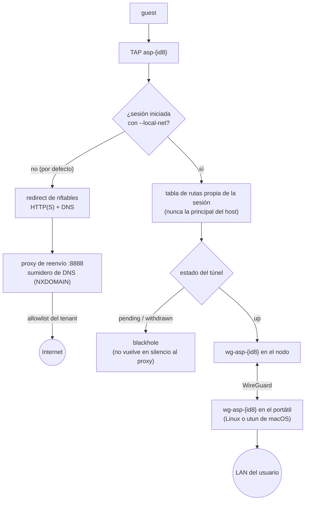

# Red de las sandboxes y egress

Cómo llega la red a una microVM y qué decide lo que puede alcanzar. El diseño: [ADR-0002](../adr/0002-networking.md) y [ADR-0006](../adr/0006-fase-2e-nft-ssh-guest.md); instalar un nodo: [instalar un nodo](../how-to/install-node.md).

## El modelo en una pantalla

- Cada sandbox tiene **su propio TAP** (`asp-<8 primeros caracteres del id>`) y **su propia /30** de `--guest-subnet` (por defecto `10.200.0.0/16`): el host es la `.1` y el guest la `.2`. Dos sandboxes nunca comparten red, y el nodo reconoce a cada una por la **IP de origen**.
- El guest no recibe `NET_ADMIN` y **no sale a Internet por sí mismo**: lo único que alcanza es su gateway, donde el nodo escucha un **proxy HTTP(S)** (`--egress-proxy-listen`) y un **sumidero de DNS** (`--egress-dns-sink`). El proxy es quien sale a Internet, desde el host, y solo a lo que la política de egress del tenant permite.
- Con `nftables` el nodo hace que eso **no sea voluntario**: la tabla `asp_egress` redirige el HTTP(S) y el DNS del guest al proxy y al sumidero y descarta todo lo demás.
- Por eso **no hace falta NAT** (`MASQUERADE`) para el egress: el guest nunca envía tráfico a Internet por el host, sino al proxy, y las reglas descartan cualquier reenvío. Si tenías una tabla de NAT de antes, no hace daño, y el descarte de `asp_egress` sigue mandando.

Y con `--local-net` (el opt-in de una sesión, [ADR-0010](../adr/0010-on-demand-local-net.md)) el camino cambia entero: la ruta por defecto de esa sesión sale por un túnel WireGuard hasta el portátil del usuario, no por el proxy.



**Los secretos se quedan en el host.** El agente SSH vive en el host: dentro del guest, `SSH_AUTH_SOCK` apunta a un proxy de vsock (puerto 26501) que reenvía las peticiones de firma, con una aprobación explícita si se pide; la clave privada no se copia. Para los tokens OIDC, el guest pide uno para una audiencia (puerto 26502); el node-agent toma la sandbox de la conexión vsock del guest, así que un guest no puede pedir el token de otra, y el plano de control firma un JWT corto con el tenant que sale de su almacén (lo que el guest diga de un usuario se ignora). [Modelo de seguridad](security-model.md#el-guest-y-las-credenciales).

## La red de una sandbox (`--tap-auto`)

Con `--tap-auto` (`ASP_TAP_AUTO=1`), el reconciler crea el TAP antes de arrancar la VM (`ip tuntap add`, `link set up`, `addr add <host>/30`) y lo borra al pararla. El guest recibe su dirección en la línea de comandos del kernel, junto a la base de siempre (`console=ttyS0 root=/dev/vda reboot=k panic=1`). Si un paso falla (sin `CAP_NET_ADMIN`, o el nombre ya existe) la sandbox pasa a `failed` con el motivo `tap: …`, se borra el TAP a medio crear y la VM no arranca sin red; solo `--dry-run` tolera el fallo. **Sin `--tap-auto` no hay red**: la VM pide un TAP que nadie crea, y tampoco hay `/30`, `ip=` ni proxy en el guest; es solo para depurar.

### Lo que sabe el guest de su red

El node-agent escribe todo esto en la línea de comandos del kernel y la imagen del guest lo aplica al arrancar; no hay nada que configurar a mano:

| Qué | Cómo llega | Dónde se ve |
|---|---|---|
| Dirección y gateway | `ip=<guest>::<gw>:255.255.255.252:…` (un kernel sin `CONFIG_IP_PNP` ignora `ip=`: la imagen lo aplica con `cmdline-ip.service`) | `ip route` |
| Hostname `asp-<shortid>` (el nombre de su TAP) | 5.º campo de `ip=` → `/etc/hostname`, `/etc/hosts`, hostname del kernel | `hostname` |
| Resolver = su gateway, si el nodo tiene DNS sink alcanzable (redirect nft de `:53` o sink en `:53`) | 8.º campo de `ip=` → `/etc/resolv.conf` (`options timeout:2 attempts:2`) | `cat /etc/resolv.conf` |
| `HTTP_PROXY`, `HTTPS_PROXY`, `NO_PROXY` (y en minúsculas) apuntando al gateway:`--egress-proxy-listen`, si el nodo tiene proxy | `systemd.setenv=…` → entorno de todos los servicios, pod-daemon y por tanto de los comandos que ejecuta | `env \| grep -i proxy` |
| Hora del host | `chrony` con `refclock PHC /dev/ptp0` (`ptp_kvm`, que carga `modules-load.d`); sin servidores de red | `chronyc tracking` |

Un nodo sin sink alcanzable **no** da resolver (una consulta falla al instante en vez de agotar el tiempo contra algo que no contesta); sin proxy, no hay variables. Una imagen anterior a esto ignora `systemd.setenv=` y los campos nuevos de `ip=`: sigue arrancando, pero sin nombre, sin DNS y sin variables; hay que reconstruirla (`scripts/build-guest-rootfs.sh`). Para un proceso que no sea hijo de pod-daemon (un servicio propio del guest) las variables solo están si lo arrancó systemd.

## Qué puede alcanzar: la política de egress

El tenant tiene una política (`PUT /v1/tenants/{id}/egress`: un modo y reglas con `host_pattern` y, opcionalmente, `port`). Es **deny-by-default**: el proxy y el sumidero de DNS identifican la sandbox por la **IP de origen**, nunca por cabeceras que escribe el guest (`X-ASP-Allowlist-JSON` y `X-ASP-Sandbox-ID` se borran de la petición reenviada y no cambian la decisión), y deciden así:

1. Origen dentro de la /30 de una sandbox → **la política de su tenant**. Cada sondeo de trabajo del nodo trae la política efectiva de cada sandbox asignada y su versión; el reconciler la aplica antes del primer arranque (el guest no espera a un `exec` para tener red) y de nuevo cuando la versión cambia, así que un `PUT` del tenant llega a las sandboxes en marcha en el siguiente sondeo (unos 2 s). Mientras una sandbox no tiene política, deny.
2. Origen que no es una sandbox → la política del entorno `ASP_EGRESS_ALLOWLIST_JSON` del node-agent ([variables sin opción](../reference/configuration/node-agent.md#variables-sin-opción)).
3. Si no, deny.

El tenant sin ninguna regla depende de `ASP_EGRESS_DEFAULT_ALLOW` del plano de control (`1` todo, `0` nada): en un despliegue real, `0`.

**Destinos que el proxy nunca marca.** La allowlist es del tenant y nombra hosts, pero un nombre puede resolver a cualquier cosa, también al propio nodo. El proxy corre en el netns del host, así que sin más un guest podría apuntar un nombre suyo a `127.0.0.1` y usarlo para llegar al API local del node-agent (exec sin autenticar en `:9100`), a los metadatos de la nube (`169.254.169.254`) o a la LAN del nodo. Por eso, tras resolver el nombre y sobre la dirección a la que va a conectar, el proxy rechaza (**403**, audit `destination_blocked`) loopback, link-local, no especificadas, multicast, rangos reservados, las direcciones del propio nodo y la red de los guests (`--guest-subnet`), aunque la allowlist del tenant diga que sí. Las redes privadas (RFC 1918, ULA, CGNAT) tampoco, salvo las que el operador abra con `--egress-allow-cidr` (p. ej. `--egress-allow-cidr=10.50.0.0/16` para un mirror interno); un tenant no puede abrirlas.

**Puertos.** Una regla sin `port` vale para 80 y 443; cualquier otro puerto necesita una regla que lo nombre (`{"host_pattern":"git.example.com","port":22}`). Una regla sin puerto dejaba pasar `CONNECT host:22`, `:5432`… a todo lo que el host sirviera.

Deny → HTTP **403**. El proxy se arranca con `--egress-proxy-listen` (recomendado junto a `--egress-enforce`). Hardening: rate-limit token-bucket por host/sandbox, límite del body de las peticiones (`ASP_EGRESS_MAX_BODY`, 413; las respuestas no se cortan), deny de schemes no-HTTP, audit JSON. MITM CONNECT bump **off** por defecto; solo con `--egress-mitm` / `ASP_EGRESS_MITM=1` + `--egress-mitm-ca` (corp caution).

## DNS

**Opción A (recomendada con el proxy):** usar solo el proxy para HTTP(S) y bloquear el UDP/53 saliente del guest hacia resolvers públicos, para que no salte el proxy por DNS directo. Es lo que hace el redirect de nftables.

**Opción B:** `--egress-dns-sink=:5353`, un stub UDP que resuelve solo los nombres permitidos y responde **NXDOMAIN** al resto. El guest recibe un `resolv.conf` que apunta a la IP del host en su /30 (el redirect lleva el `:53` al puerto 5353; o escucha en `:53` si el agente tiene `CAP_NET_BIND_SERVICE`). Con el redirect y `--nft-dns-action=redirect` el sumidero arranca solo en `:5353` si no lo nombras.

## Forzarlo: el redirect de nftables

**Está activado por defecto en cuanto el nodo tiene `--egress-proxy-listen` y no es `--dry-run`, y su modo por defecto es `enforce`**: un nodo que no puede aplicar las reglas (sin root, sin `nft`) no arranca, en vez de arrancar sin control. `--egress-nft-redirect=false` lo apaga (el proxy pasa a ser voluntario: un guest que no use `HTTP_PROXY` sale por donde el host reenvíe; el agente lo avisa) y `--nft-egress-mode=soft` vuelve al aviso: el nodo arranca aunque no pueda aplicar las reglas. El script va dentro del binario: no hay nada que instalar (`ASP_NFT_SCRIPT` nombra uno propio).

Con el redirect, la tabla `asp_egress` hace esto con lo que el guest envía:

- redirige sus puertos HTTP(S) (`--nft-http-ports`, `80,443`) al proxy, y su DNS al sumidero (`--nft-dns-action=redirect`) o lo descarta (`drop`);
- **descarta todo lo demás**: otros puertos, otros guests, los servicios del host (solo alcanza el proxy y el sumidero, nunca el node-agent ni `sshd`) y orígenes falsificados (un guest solo puede usar la /30 de su propio TAP, así que no puede tomar prestada la política de otro);
- solo reenvía el túnel propio de una sesión local-net (`wg-asp-*`). Los TAPs se reconocen por su nombre (`asp-*`).

Cada nodo informa `egress_enforced` al registrarse y `asp node list` lo muestra en la columna `EGRESS` (`enforced` u `off`): `off` significa que la política de egress del tenant **no obliga** a los guests de ese nodo. Es `true` solo con el proxy escuchando y las reglas puestas en modo `enforce`. Sin `--egress-proxy-listen`, un nodo con `--tap-auto` lo avisa en el log. `sudo asp doctor` comprueba la tabla ([diagnosticar un nodo](../how-to/troubleshooting.md)).

```bash
# Ver qué reglas aplicaría, sin root: debe listar la tabla asp_egress, 80/443 y el DNS
./scripts/nftables-egress-redirect.sh dry-run \
  --guest-subnet 10.200.0.0/16 --proxy-port 8888 --dns-sink-port 5353

# Aplicarlas a mano (root + nft); el node-agent lo hace solo, con estas mismas opciones
sudo ./scripts/nftables-egress-redirect.sh apply --mode enforce \
  --guest-subnet 10.200.0.0/16 --proxy-port 8888 \
  --dns-sink-port 5353 --dns-action redirect
```

**Comprobarlo en un host KVM:** `make smoke-egress-kvm` (root, `ASP_SMOKE_ROOTFS=` con la imagen del guest) levanta el plano de control y el agente en un netns propio, con un «internet» falso detrás de un veth, y comprueba que el guest solo llega a un host permitido por el proxy, con o sin `HTTP_PROXY`, que recibe 403 para el resto y que no alcanza otros puertos; luego repite con `--egress-nft-redirect=false` para ver que la prueba distingue. No toca la red del host.

## Configurarlo

En el nodo (en `/etc/asp/agent.yaml.d/`, o como opciones):

```yaml
tap_auto: true
egress_proxy_listen: ":8888"
egress_dns_sink: ":5353"
egress_enforce: true          # el check interno responde 403 ante un deny (el proxy deniega igual sin esto)
```

En el plano de control, la política de cada tenant (`PUT /v1/tenants/{id}/egress`) y `ASP_EGRESS_DEFAULT_ALLOW=0`. Los ajustes de cada componente: [node-agent](../reference/configuration/node-agent.md) y [plano de control](../reference/configuration/control-plane.md).

## Qué obliga y qué no

- **Lo que hace el redirect depende de que se aplique.** En `soft`, o con `--egress-nft-redirect=false`, no hay frontera: el proxy es voluntario. La integración continua no demuestra la resistencia al bypass (usa `--dry-run`); eso solo se ve con TAP y KVM reales (`make smoke-egress-kvm`).
- **El egress que gobierna esta política es el HTTP(S) y el DNS.** Otros protocolos no tienen salida (el resto se descarta), salvo el túnel local-net de una sesión que lo pidió ([ADR-0010](../adr/0010-on-demand-local-net.md)).
- **El proxy decide por nombre y puerto, no por contenido.** Comprueba el nombre, el puerto y que la dirección a la que va a conectar no sea de las que nunca marca. No inspecciona lo que viaja: el MITM de `CONNECT` está **apagado** por defecto (`--egress-mitm` con `--egress-mitm-ca`, con cautela corporativa, y los guests tienen que confiar en esa CA).
