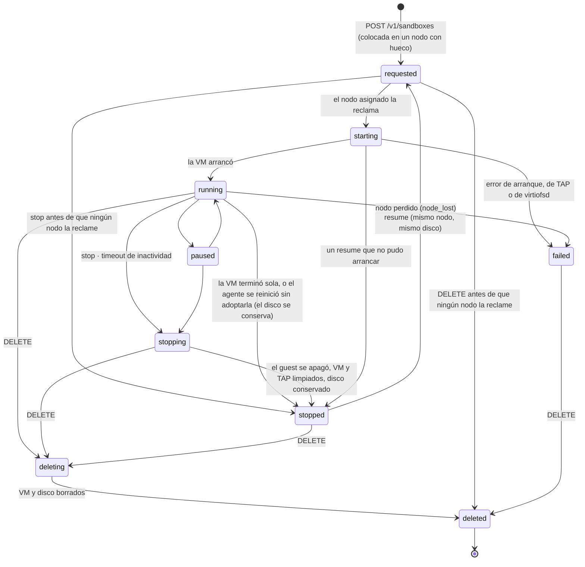

# Cómo funciona una sesión, y la vida de una sandbox

Una **sesión** es una sandbox con nombre y larga vida: la que un agente usa durante horas, con muchos comandos, en vez de crear y destruir una por comando ([ADR-0009](../adr/0009-agent-sessions.md)). Esta página cuenta qué pasa entre los componentes cuando se abre, se usa y se cierra, y por qué estados pasa la sandbox. Las palabras, en el [glosario](../reference/glossary.md).

## Abrir, usar y cerrar una sesión

El fichero local de la sesión guarda solo el id de la sandbox y la URL del plano de control: **nunca un token**.

```mermaid
sequenceDiagram
  autonumber
  participant H as Harness
  participant C as asp (CLI)
  participant CP as Plano de control
  participant NA as node-agent
  participant VM as microVM (pod-daemon)

  H->>C: asp session start --name agent
  C->>CP: POST /v1/sandboxes (Bearer JWT)
  Note over CP: la coloca en un nodo con hueco<br/>(503 si ninguno cabe)
  CP-->>C: id de la sandbox, nodo, state=requested
  NA->>CP: GET /v1/nodes/{id}/work
  NA->>CP: POST /v1/sandboxes/{id}/claim (solo el nodo asignado)
  NA->>VM: TAP + nft + arranca Cloud Hypervisor
  NA->>CP: POST /v1/sandboxes/{id}/status running
  C->>CP: sondea hasta running
  C-->>H: id (escribe ~/.cache/asp/sessions/agent.json)

  loop cada llamada a una herramienta
    H->>C: asp session exec --name agent --cmd '…'
    C->>CP: POST /v1/sandboxes/{id}/exec?stream=1
    CP->>NA: /v1/internal/exec (mTLS si el nodo es otro host)
    NA->>VM: vsock 26500
    VM-->>C: NDJSON stdout / stderr / exit
    C-->>H: la misma salida, el mismo código de salida
  end

  H->>C: asp session stop --name agent
  C->>CP: POST /v1/sandboxes/{id}/stop
  NA->>VM: el guest se apaga; se limpian el TAP y los sockets, el disco se conserva
  Note over H,VM: después: asp session resume la arranca otra vez sobre el mismo disco;<br/>asp session rm borra la sandbox y su disco
```

Para trabajos sueltos (CI, operaciones) queda la primitiva `asp sandbox run --cmd '…'`, que hace crear → ejecutar → destruir en una llamada ([one-shot y autenticación](../ops-asp-agent-runner.md)). El contrato completo de las sesiones, sus opciones y su tabla de fallos: [sesiones](../ops-asp-session.md).

## El ciclo de vida de una sandbox

El plano de control guarda el estado **deseado**; el node-agent lo reconcilia con lo que de verdad corre. Cada cambio se guarda con un contador (`state_version`) y cada sondeo de trabajo dice además al nodo qué sandboxes siguen asignadas a él: **el nodo detiene cualquier VM que no figure**, así que una sandbox que se dio por perdida o se destruyó nunca sigue corriendo en un nodo que vuelve.



- **Colocación.** El plano de control elige el nodo al crear, entre los que pueden aceptar sandboxes, según su CPU libre (sobresuscrita 4× por defecto), su memoria y sus huecos; `ASP_SCHED_POLICY=spread|binpack`. Si no cabe en ninguno, el `create` falla al instante con 503 y los motivos; solo el nodo elegido puede reclamar la sandbox. [Varios servidores](../ops-multi-node.md).
- **Parar no es borrar** ([ADR-0012](../adr/0012-retained-disks.md)). Un `stop` apaga el guest y conserva su disco en el nodo, así que lo que el agente instaló fuera de `/workspace` sigue ahí tras `asp session resume`. La reanudación va al nodo que tiene el disco: 409 si está en cordon o caído, 503 si está lleno. `DELETE` (`asp session rm`) borra la VM y el disco. Una sandbox borrada se queda en la base como `deleted` (no sale en la lista sin `?include_deleted=1`) para que sus eventos sobrevivan.
- **Reaper de inactividad.** Con `ASP_SANDBOX_IDLE_TIMEOUT=2h`, una sandbox olvidada se **para**, no se borra: `asp session resume` la trae de vuelta. Crear, llegar a `running` y un `exec` con éxito cuentan como actividad; las consultas de estado y los latidos no. Apagado por defecto.
- **Un nodo que falla.** Uno que calla más de `ASP_NODE_STALE_AFTER` (90 s) no recibe sandboxes nuevas y pasa a `offline`; a los `ASP_NODE_FAILOVER_AFTER` (5 min) se le hace fencing (si hay un `FenceProvider`) y sus sandboxes fallan con `node_lost`. No se mueven: el disco del guest vive en ese servidor. Un nodo que vuelve detiene las VMs que ya no son suyas. [ADR-0011](../adr/0011-multi-node.md).
- **Reiniciar el node-agent no para las VMs** que corren confinadas: el proceso nuevo las adopta ([ADR-0014](../adr/0014-vms-outlive-the-agent.md)). Las que no adopta, pasan a `stopped` con su disco.
