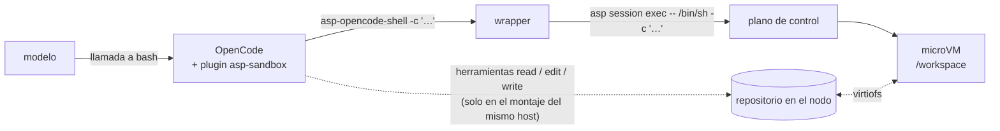

# Usar ASP con OpenCode

[OpenCode](https://opencode.ai) ejecuta cada llamada a su herramienta bash como `<shell> -c "<comando>"`, y su opción `shell` elige ese binario. [`integrations/opencode/`](../../integrations/opencode/README.md) lo apunta a ASP: cada comando que ejecuta el modelo va a `asp session exec` y corre dentro de la microVM.

| Fichero | Qué hace |
|---|---|
| `asp-opencode-shell` | El `shell`. Ejecuta cada comando con `/bin/sh -c` en la sesión y devuelve el código de salida del comando del guest. |
| `plugins/asp-sandbox.ts` | El plugin de OpenCode. Se niega a caer al shell del host si falta el wrapper, traslada `workdir` al guest y le dice al modelo que su herramienta bash corre en Linux, en la sandbox. |
| `instructions/*.md` | Lo que el modelo necesita saber de la sandbox, un fichero por montaje. |
| `opencode.*.json` | Configuraciones de proyecto de ejemplo, una por montaje. |



Antes de empezar necesitas un plano de control y un nodo ([empezar](quickstart.md)) y el CLI `asp`.

## Elige un montaje

| | Solo bash | Mismo host |
|---|---|---|
| Dónde corre OpenCode | En cualquier máquina, por ejemplo tu portátil | En el nodo que corre la sesión |
| Dónde está el repositorio | En la sandbox: un directorio `--workspace` del nodo, o el disco del propio guest | En el nodo, compartido con el guest por `--workspace` |
| Las herramientas read / edit / write / glob / grep / list de OpenCode | Denegadas. El modelo lee y edita ficheros con bash, en la sandbox | En el host, sobre los mismos ficheros que el guest ve por virtiofs |
| Ficheros | `opencode.bash-only.json`, `instructions/bash-only.md` | `opencode.same-host.json`, `instructions/same-host.md` |

El montaje «solo bash» se probó de extremo a extremo con OpenCode 1.18.34: desde un portátil contra un nodo, comprobando la tarea, la traslación de `workdir`, la guarda del wrapper ausente y el dueño de los ficheros.

## 1. Instala el CLI y autentícate

```bash
make asp && install -m 0755 build/asp ~/.local/bin/asp   # cualquier directorio del PATH

export ASP_CONTROL_PLANE_URL=https://asp.example.internal          # tu plano de control
asp auth login                                          # con un IdP
# o, en un laboratorio sin IdP:  export ASP_API_KEY=…
```

## 2. Abre una sesión

`--workspace` comparte un directorio del nodo con el guest en `/workspace`. En el montaje del mismo host, ejecútalo desde el repositorio:

```bash
cd ~/src/my-project
asp session start --name opencode --workspace "$PWD" --timeout=120s
```

El plano de control coloca la sesión en un nodo con hueco. Con varios nodos, fija uno con `--node-id` si la ruta de `--workspace` solo existe allí. Añade `--local-net` si el agente debe alcanzar tu LAN.

## 3. Instala el wrapper

```bash
install -m 0755 integrations/opencode/asp-opencode-shell ~/.local/bin/asp-opencode-shell
```

Los comandos corren como el dueño de `/workspace`: lo hace el pod-daemon del guest (como su cuenta `sandboxd` cuando el workspace es de root), así que los ficheros que crea el agente conservan tu uid en el host: virtiofs no traduce ids. `ASP_GUEST_AS_ROOT=1` pide root (`asp session exec --root`). Una imagen del guest construida antes de que el pod-daemon aprendiera esto lo ejecuta todo como root e ignora la petición: reconstruye el rootfs. Las imágenes construidas antes de [#83](https://github.com/luisgf/agent-sandbox-platform/pull/83) tienen `/` en modo 0700 y solo root puede ejecutar nada: reconstruye el rootfs, o usa `ASP_GUEST_AS_ROOT=1`. La cabecera del script lista el resto de sus variables.

## 4. Añade el plugin, las instrucciones y la configuración al proyecto

```bash
cd ~/src/my-project
ASP_KIT=~/src/agent-sandbox-platform/integrations/opencode
mkdir -p .opencode/plugins
cp "$ASP_KIT/plugins/asp-sandbox.ts" .opencode/plugins/
cp "$ASP_KIT/instructions/bash-only.md" .opencode/asp-sandbox.md   # o same-host.md
cp "$ASP_KIT/opencode.bash-only.json" opencode.json                # o opencode.same-host.json
```

Pon en `"shell"` de `opencode.json` la ruta absoluta del wrapper. Deja el plugin en el proyecto, no en `~/.config/opencode/plugins`: trata cualquier `shell` configurado como el wrapper de ASP.

Lo que fijan las configuraciones de ejemplo, y por qué:

- **`external_directory`.** OpenCode comprueba las rutas de los comandos bash contra el directorio del proyecto **en el host**, así que `/workspace/...` le parece una ruta de fuera. Solo bash: `allow`, porque toda ruta de bash es una ruta del guest y las herramientas de ficheros están apagadas. Mismo host: se permiten `/workspace` y `/tmp` y todo lo demás pregunta, porque las herramientas de ficheros siguen actuando en el host.
- **`webfetch: ask`.** `webfetch` corre en el host, fuera de la política de egress de la sesión.
- **`lsp` y `formatter` apagados.** Ejecutan binarios del host sobre el repositorio.

## 5. Lanza OpenCode

```bash
export ASP_SESSION_NAME=opencode ASP_WORKSPACE_HOST="$PWD"
opencode
```

**Compruébalo:** pide al agente que ejecute `hostname && id && pwd`. Debes ver el nombre del guest, tu uid y `/workspace`, no tu máquina.

En scripts, dale a `opencode run` una entrada vacía: `opencode run "…" < /dev/null`. Sin terminal, espera el EOF de stdin.

**Si el plano de control solo se alcanza desde el nodo** (por ejemplo un laboratorio con la API en loopback), define `ASP_SSH`: el wrapper manda entonces cada comando por ssh y se ejecuta en el nodo con `--remote-exec`. `ASP_REMOTE_EXEC` es ese comando remoto, con el entorno que `asp` necesita allí:

```bash
export ASP_SSH=ubuntu@node1
export ASP_REMOTE_EXEC='env ASP_CONTROL_PLANE_URL=http://127.0.0.1:8080 /home/ubuntu/.local/bin/asp-opencode-shell --remote-exec'
```

Por ssh, los nombres de sesión y los directorios del guest solo pueden usar `A-Z a-z 0-9 _ . / -`, y no hay terminal interactiva.

## 6. Para la sesión

```bash
asp session stop   --name opencode    # apaga la sandbox, conserva su disco
asp session resume --name opencode    # la arranca otra vez sobre ese disco
asp session rm     --name opencode    # borra la sandbox, su disco y el fichero de la sesión
```

Si te olvidas, el plano de control la para tras `ASP_SANDBOX_IDLE_TIMEOUT` (si está activado), que es una parada como cualquier otra: un `exec` posterior falla con `idle timeout` y dice que su disco se conserva (`asp session resume --name opencode`). `stop` antes borraba; para borrar ahora, `rm`.

## Qué está en la sandbox y qué no

| | Dónde corre |
|---|---|
| Las llamadas a bash y los comandos `!` (`npm test`, `git`, `curl`, …) | **En la microVM**, como el dueño de `/workspace`, con la política de egress de la sesión y el agente SSH del host. |
| Las herramientas read / edit / write / glob / grep / list de OpenCode | Solo bash: denegadas. Mismo host: **en el host**, sobre el repositorio compartido. |
| `webfetch` | En el host, tras tu aprobación. |
| OpenCode, las llamadas a la API del LLM y tus credenciales | En el host. Nunca entran en el guest. |

## Notas prácticas

- Una sesión por agente. Dos OpenCode con `ASP_SESSION_NAME` distinto tienen dos sandboxes independientes.
- Si ningún nodo tiene hueco, `session start` falla con `no capacity` y el motivo (por ejemplo `2 max_sandboxes`). `asp node list` enseña lo que usa cada nodo.
- Si el nodo de la sesión se pierde, la sandbox falla con `node_lost` y `session status` lo dice; su disco vivía en ese servidor, así que `asp session start --force`. Reanudar pide el nodo que tiene el disco: responde 503 si está lleno y 409 si está en cordon o caído.
- Un exec con búfer (`--buffered`, `--json`, `asp sandbox exec|run`) puede durar `ASP_BUFFERED_EXEC_TIMEOUT` en el plano de control (10 minutos por defecto); una petición puede pedir menos con `--exec-timeout`. Pasado ese tiempo, el plano de control responde 504 y el guest mata el comando. Un exec en streaming, el de por defecto de `asp session exec`, no tiene límite de tiempo: acaba cuando el comando sale o cuando el cliente se va, y entonces el guest mata el comando. `--stream-idle-timeout-secs` en la imagen del guest añade un límite por inactividad.
- OpenCode mezcla stdout y stderr. Un error de `asp` (`no active session`, 401, la red) sale con 1 como un comando que falla; el modelo los distingue por el mensaje. Los errores de uso del wrapper salen con 125 y los de ssh con 255.
- El plugin edita el prompt del sistema con el hook experimental de OpenCode `experimental.chat.system.transform`. Fija la versión de OpenCode y, tras actualizarlo, comprueba que el modelo sigue viendo `/workspace` y `Platform: linux`.
- El plugin mueve `workdir` de la llamada a la herramienta al wrapper, así que la llamada que se ve en la sesión ya no lo lleva.
- Las imágenes del guest construidas antes de `workspace-virtiofs.service` no montan `/workspace` solas. Ejecuta una vez `mkdir -p /workspace && mount -t virtiofs workspace /workspace` a través del wrapper con `ASP_GUEST_AS_ROOT=1`, o reconstruye el rootfs.
- ¿Sin `--workspace`? El montaje «solo bash» funciona igual sobre el disco del propio guest. En el montaje del mismo host, las herramientas de ficheros del host y el shell verían ficheros distintos.

El contrato completo de las sesiones, sus opciones y su tabla de fallos: [sesiones](../ops-asp-session.md). Cualquier otro harness que deje sustituir su shell funciona igual.

## Funciones opcionales de una sesión

| Opción | Qué hace | Guía |
|---|---|---|
| `--workspace /ruta/absoluta` | Comparte un directorio del host con el guest por virtiofs, montado en `/workspace`. | [sesiones](../ops-asp-session.md#virtiofs-y-pty--qué-aterrizó) |
| `--local-net` + `asp session local-net up` | Saca el tráfico de la sesión por un túnel WireGuard hasta tu máquina. | [red local bajo demanda](../ops-local-net.md) |
| `asp auth login` | Obtiene y guarda un token del IdP; el CLI lo envía como Bearer solo. | [conectar un IdP](../how-to/idp.md) |
| `ASP_SANDBOX_IDLE_TIMEOUT` | Para las sandboxes inactivas en el plano de control (sus discos se conservan). | [plano de control](../../control-plane/README.md) |
| `asp session stop` / `resume` / `rm` | Parar conserva el disco, reanudar la arranca otra vez en el mismo nodo, rm la borra. `ASP_STOPPED_SANDBOX_TTL` (7 días) acota cuánto se guarda una parada. | [ADR-0012](../adr/0012-retained-disks.md) |
